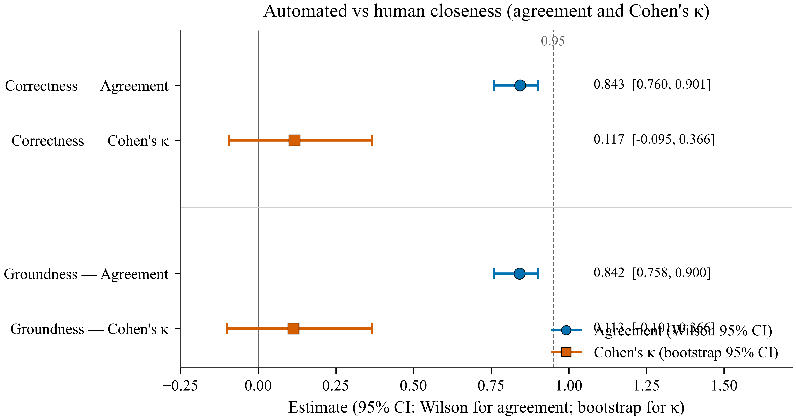
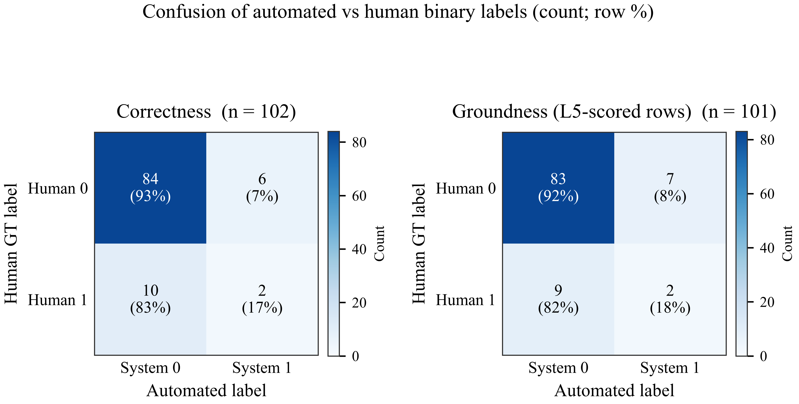
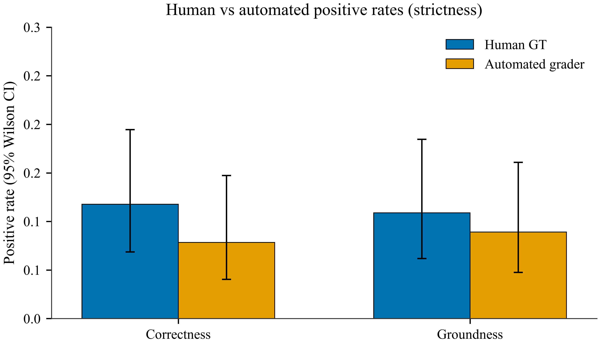

# Harvey system vs human GT

One-off mapping (harness only, production gate unchanged):

- **Correctness** = L5 `correctness`, except L4 FAIL → 0 and L5 skipped.
- **Groundness** = L5 `material_completeness` only when L5 ran.

Scored 102 / 102 GT rows. L4-fail (no L5): 1. L5 ran: 101. Rows with an error string: 0.

Scoring is complete: 102/102 paired Correctness rows. Groundness is 101/102 because L4-fail rows omit Groundness (1 such row(s)).

## Headline

**Correctness** (n = 102 of 102): agreement 0.843 (0.760–0.901); Cohen's κ 0.117 (-0.095–0.366).

**Groundness** (n = 101 of 102): agreement 0.842 (0.758–0.900); Cohen's κ 0.113 (-0.101–0.366).

Correctness strictness: the system is directionally stricter (more FN than FP), but McNemar does not reject symmetry (McNemar exact p = 0.454). Human positive rate 0.118 (0.069–0.194); system 0.078 (0.040–0.147).

Groundness strictness: the system is directionally stricter (more FN than FP), but McNemar does not reject symmetry (McNemar exact p = 0.804). Human positive rate 0.109 (0.062–0.185); system 0.089 (0.048–0.161).

Correctness: do not claim ~95% comparability on this snapshot. The entire Wilson 95% CI for agreement lies below 0.95. κ = 0.117 is low: raw agreement is inflated by the many human-negative rows.

Groundness: do not claim ~95% comparability on this snapshot. The entire Wilson 95% CI for agreement lies below 0.95. κ = 0.113 is low: raw agreement is inflated by the many human-negative rows.

## Summary

| Dimension | n | Agreement (95% Wilson CI) | Cohen's κ (95% bootstrap CI) | Precision (95% Wilson CI) | Recall (95% Wilson CI) | F1 | Human pos. (95% Wilson CI) | System pos. (95% Wilson CI) | TN/FP/FN/TP |
| --- | --- | --- | --- | --- | --- | --- | --- | --- | --- |
| Correctness | 102 | 0.843 (0.760–0.901) | 0.117 (-0.095–0.366) | 0.250 (0.071–0.591) | 0.167 (0.047–0.448) | 0.200 | 0.118 (0.069–0.194) | 0.078 (0.040–0.147) | 84/6/10/2 |
| Groundness | 101 | 0.842 (0.758–0.900) | 0.113 (-0.101–0.366) | 0.222 (0.063–0.547) | 0.182 (0.051–0.477) | 0.200 | 0.109 (0.062–0.185) | 0.089 (0.048–0.161) | 83/7/9/2 |

Human positives are sparse in the full GT (Correctness 12/102, Groundness 11/102). Agreement can look high while the system rarely predicts 1; κ and the confusion counts are the useful closeness numbers.

## Confusion matrices

### Correctness

|  | System 0 | System 1 |
| --- | --- | --- |
| Human 0 | 84 | 6 |
| Human 1 | 10 | 2 |

### Groundness (L5 rows only)

|  | System 0 | System 1 |
| --- | --- | --- |
| Human 0 | 83 | 7 |
| Human 1 | 9 | 2 |

## Per-group agreement

Wilson / bootstrap CIs are shown only for groups with n ≥ 10. Smaller groups report the point estimate only.

### Correctness by Harvey group

| Group | n | Agreement | Kappa | Human pos. | System pos. |
| --- | --- | --- | --- | --- | --- |
| 1 | 10 | 0.700 (0.397–0.892) | -0.154 (-0.364–0.000) | 0.100 | 0.200 |
| 2 | 10 | 0.700 (0.397–0.892) | -0.154 (-0.364–0.000) | 0.200 | 0.100 |
| 3 | 10 | 0.700 (0.397–0.892) | 0.000 (0.000–0.000) | 0.300 | 0.000 |
| 4 | 10 | 0.800 (0.490–0.943) | 0.000 (0.000–0.000) | 0.000 | 0.200 |
| 5 | 10 | 1.000 (0.722–1.000) | n/a | 0.000 | 0.000 |
| 6 | 10 | 1.000 (0.722–1.000) | n/a | 0.000 | 0.000 |
| 7 | 12 | 1.000 (0.758–1.000) | n/a | 0.000 | 0.000 |
| 8 | 30 | 0.833 (0.664–0.927) | 0.359 (-0.098–0.762) | 0.200 | 0.100 |

### Groundness by Harvey group

| Group | n | Agreement | Kappa | Human pos. | System pos. |
| --- | --- | --- | --- | --- | --- |
| 1 | 10 | 0.700 (0.397–0.892) | -0.154 (-0.364–0.000) | 0.100 | 0.200 |
| 2 | 10 | 0.700 (0.397–0.892) | 0.000 (0.000–0.000) | 0.300 | 0.000 |
| 3 | 10 | 0.900 (0.596–0.982) | 0.000 (0.000–0.000) | 0.100 | 0.000 |
| 4 | 10 | 0.900 (0.596–0.982) | 0.000 (0.000–0.000) | 0.000 | 0.100 |
| 5 | 10 | 1.000 (0.722–1.000) | n/a | 0.000 | 0.000 |
| 6 | 9 | 1.000 | n/a | 0.000 | 0.000 |
| 7 | 12 | 1.000 (0.758–1.000) | n/a | 0.000 | 0.000 |
| 8 | 30 | 0.733 (0.556–0.858) | 0.167 (-0.200–0.556) | 0.200 | 0.200 |

## Methods

- **Agreement, positive rates, precision, recall:** binomial proportions with 95% Wilson score intervals.
- **Cohen's κ:** chance-corrected agreement. 95% CI is a percentile bootstrap (B = 10,000, seed = 20260906). κ is reported as unidentified when only one class is observed (expected agreement = 1).
- **McNemar (exact):** two-sided binomial test on discordant pairs (system-only-positive vs human-only-positive), as a secondary check for systematic strictness, not as a closeness metric.
- **Groundness sample:** L5-scored rows only. L4 FAIL sets Correctness = 0 and omits Groundness.

## Figures

**Figure 1.** Agreement and Cohen's κ for the automated grader versus human GT, with 95% confidence intervals (Wilson score for agreement; percentile bootstrap for κ). The dashed line marks 0.95 agreement. κ is the primary closeness measure because human positives are sparse.

Vector: `figures/fig1_closeness.pdf` (paper), `figures/fig1_closeness.svg`. PNG exported at 600 dpi.

**Figure 2.** Confusion matrices. Each cell shows the count and the row percentage (share of that human label). Color is ColorBrewer Blues, scaled separately in each panel.

Vector: `figures/fig2_confusion.pdf` (paper), `figures/fig2_confusion.svg`. PNG exported at 600 dpi.

**Figure 3.** Human versus automated positive rates with 95% Wilson score intervals. Directional strictness is read from these rates and from McNemar's exact test on discordant pairs.

Vector: `figures/fig3_strictness.pdf` (paper), `figures/fig3_strictness.svg`. PNG exported at 600 dpi.
